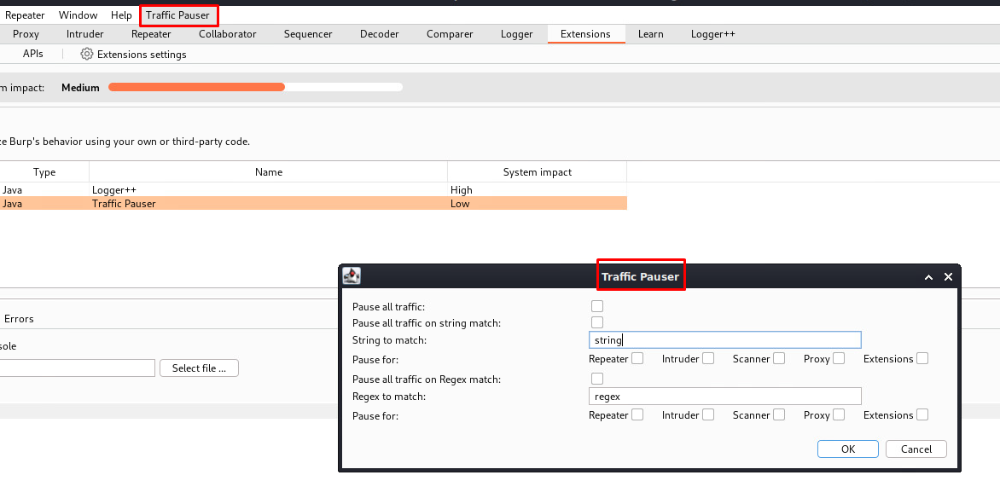

# Burp Suite Traffic Pauser extension

This extension pauses all traffic passing through the burp suite and all it's tools. It allows setup of automatic filters to makes this pause automatically, either on string match or regex match in response

## Installation

Download the JAR from [Releases](https://github.com/r3l1v/traffic-pause/releases). In Burp Suite, go to the Extensions tab in the Extender tab, and add a new extension. Select the extension type Java, and specify the location of the JAR.

Building the extension is possible with gradle. All necessary files are included in the this directory.

## Usage

Upon adding the extension into Burp Suite, Traffic pauser settings can be invoked from the main settings bar in Burp Suite. By clicking on the button `Traffic Pauser` the menu will show up. 

* First option `Pause all traffic` will simply pause all traffic coming through Burp Suite
* Second option `Pause all traffic on string match` if string in the input box below is matched in the response
* Third option `Pause all traffic on Regex match` if regex in the input box below is matched in the response

